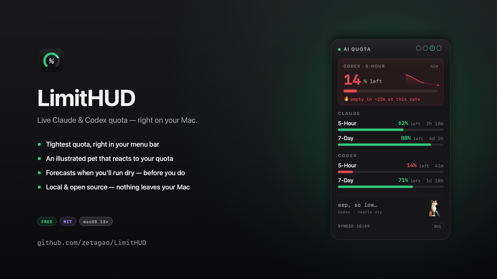

<div align="center">
  
  <h1>LimitHUD</h1>
  <p>A menu-bar HUD that keeps a live eye on your <b>Claude</b> and <b>Codex (ChatGPT)</b> usage quotas — and warns you before you run out.</p>
  <p>Lives in your menu bar · quiet when healthy · peek a card with a pet that reacts to your quota · fully customizable reminders & looks.</p>
  <p>
    
    
    
    
  </p>
  <br>
  
</div>

---

## Features

### Quota monitoring
- **Both providers, real numbers** — Claude and Codex (ChatGPT), straight from each service's own usage API (not estimates).
- **Claude**: `5-Hour` and `7-Day` windows, plus per-model weekly limits (`Opus`, `Sonnet`, hidden by default).
- **Codex**: `5-Hour` (primary) and `7-Day` (secondary/weekly) windows.
- Everything is shown as **remaining** (`% left`), not used.
- **Auto-refresh** every 30s / 1min / 5min, with a **reset countdown** per window (e.g. `2h13m`, `3d20h`).
- Graceful error rows per provider (not signed in / session expired / HTTP error) — never crashes, never blocks the other provider.

### Menu bar (the home base)
- Shows your **tightest quota as a colored %** — neutral when healthy, **amber under 50%**, **red under 20%** — so a glance tells you everything.
- **Quiet when healthy**: stays neutral until quota actually matters (toggleable).
- Point it at the **tightest** window, or lock it to **Claude** or **Codex**.
- Stays clean and text-only — the personality lives on the card.
- **Left-click** to peek a card, **right-click** for Settings… / Refresh / Quit.

### Peek & pin
- **Left-click → peek**: the card pops up right under the icon and **auto-dismisses when you click away** — popover-style, no clutter.
- **📌 Pin** to keep it as a **persistent floating HUD** — always on top across every Space and over full-screen apps, draggable anywhere.
- **Remembers where you drag it**, whether peeked or pinned.

### The card
- **Bottleneck hero** up top: the single most-constrained window across Claude & Codex as a **big %**, bar, and reset countdown — your real ceiling, front and center.
- **Burn-rate forecast** 🔥: tracks usage over time and shows *"empty in ~22m at this rate"* — but only when running out would beat the reset, so it never cries wolf.
- A **mini sparkline** of recent usage in the hero.
- Below: every window as a **semantic bar** (green > 50%, amber 20–50%, red < 20%) with `% left` and reset countdown.
- Quiet dark design — **real frosted glass**, hairline border, monospaced uppercase labels; **follows system light/dark**.
- **Resizable** (size slider), **custom background / text / bar colors** — text stays readable on any color.
- **Refill celebration**: when a window resets, the bar sweeps back, the number rolls up, and the pet throws a little party.
- `SYNCED HH:mm` timestamp, refreshed each minute. Close via ✕, the menu-bar icon, or the global hotkey.

### Your quota pet 🐾
- A little procedurally-drawn pixel creature sits at the top of the card — pick **Mochi · Cat · Ghost · Dog** in Settings.
- Its **mood tracks your tightest window**: happy ≥50%, uneasy under 50%, panicking under 20%, asleep when there's no data, partying on a refill.
- Fully animated — breathing with squash & stretch, blinks, eye darts — and each character has a **different set of actions for every mood** (a healthy dog does zoomies; a panicking one frantically headbutts the bubble to warn you).
- It talks in its own voice via a translucent speech bubble, and **physically plays with it** — nudging, swatting, phasing through, and pulling off eight different "smash" finishers (two signatures per character).
- Purely drawn in code (no image assets), in a soft pixel-mosaic style with a Morandi palette. See [the full behavior matrix](design/pet-animation-matrix.md).

### Reminders
- **Low-quota alert** — a system notification when any window drops below your threshold (default 20%).
- **Recovery reminder** — a notification when a window resets back above the threshold.
- Edge-detected, so it fires once per crossing (no spam).
- System notification + sound toggles, plus **quiet hours** to mute reminders during a daily window.

### Settings (⚙ / right-click → Settings… / ⌘,)
- **Reminders** — alert on/off, threshold %, recovery reminder, notifications, sound, quiet hours.
- **Pet** — choose your character: Mochi / Cat / Ghost / Dog.
- **Menu bar** — point at the tightest window or lock to Claude / Codex; quiet-when-healthy toggle.
- **Sources** — Claude / Codex toggles.
- **Browser** — read Claude and Codex from **different browsers / profiles** (great when they're under different Google accounts).
- **Card content** — per-window toggles to choose exactly what shows.
- **Refresh** — 30s / 1min / 5min.
- **Card** — custom global hotkey, **size**, **custom background, text & bar color**, remember position, launch at login, opacity.

---

## Privacy & Security

LimitHUD reads your **browser's session cookies locally** to call each service's own usage endpoint. Reading cookies is a sensitive thing for an app to do, so here is exactly what happens:

- Cookies are decrypted **on-device** (the browser's SQLite store + the encryption key from your login Keychain) and used **only** as the `Cookie` header to `claude.ai` / `chatgpt.com`.
- Those are **the only two hosts it ever talks to** — easy to verify with Little Snitch / Proxyman, or by grepping the source for URLs.
- Decrypted cookie values live **in memory only** — never persisted, never logged.
- **No servers, no analytics, no telemetry, no auto-updater** phoning home. Updates come from Homebrew / GitHub Releases, on your initiative.
- The whole thing is open source — audit it.
- On first run macOS asks once for **Keychain access** (to read the browser's key) and once for **notifications**. Click Allow.

---

## Requirements

- macOS 13+
- Signed into `claude.ai` and/or `chatgpt.com` in a supported browser — **Chrome, Brave, Edge, Arc, Vivaldi, Chromium, or Opera**
- A Swift toolchain to build (Xcode **or** Command Line Tools — full Xcode not required)

## Install (Homebrew)

```bash
brew install --no-quarantine zetagao/tap/limithud
```

Upgrade later with `brew upgrade --cask limithud`.

> `--no-quarantine` skips the one-time Gatekeeper warning for this signed-but-not-notarized app. Omit it if you'd rather approve the app yourself in **System Settings → Privacy & Security → Open Anyway**.

## Download & run (no build)

1. Download **LimitHUD.zip** from the [latest release](https://github.com/zetagao/LimitHUD/releases/latest).
2. Unzip and drag **LimitHUD.app** into your **Applications** folder.
3. **First launch** — the app is signed by an independent developer (not via the App Store), so macOS blocks it once:
   - Double-click it. When macOS says it can't verify the developer, open **System Settings → Privacy & Security**, scroll to the bottom, and click **Open Anyway**, then confirm. *(On older macOS you can instead Control-click the app → **Open**.)*
4. Click **Allow** when macOS asks for **Keychain** access (to read the browser's cookie key) and for **Notifications**.
5. Make sure you're signed into `claude.ai` / `chatgpt.com` in a supported browser (Chrome, Brave, Edge, Arc, Vivaldi, Chromium, or Opera).

> The app is open source and code-signed, but not Apple-notarized — that one-time warning is expected. Prefer to audit and build it yourself? See below.

## Build & Install

```bash
./setup-signing.sh    # once: create a stable self-signed code-signing cert
./build.sh            # compile + sign  →  LimitHUD.app
./build.sh run        # build and launch
./build.sh install    # build, install to /Applications, launch
./build.sh release v2.1   # build + zip + publish to a GitHub release (omit tag to re-upload latest)
```

The self-signed cert keeps the app's code identity stable across rebuilds, so the Keychain "Always Allow" sticks.

To regenerate the app icon:

```bash
swift tools/icongen.swift AppIcon.iconset && iconutil -c icns AppIcon.iconset -o AppIcon.icns
```

## How it works

- **Swift + SwiftUI + AppKit**, built with Swift Package Manager — **no Xcode project needed** (`build.sh` assembles the `.app` by hand).
- The card is a borderless, non-activating `NSPanel` at `.statusBar` level hosting a SwiftUI view.
- Chrome cookie decryption: read the Cookies SQLite DB → fetch the `Chrome Safe Storage` key from the Keychain → PBKDF2-SHA1 (salt `saltysalt`, 1003 rounds) → AES-128-CBC (handling the 32-byte domain-hash prefix on Chrome ≥ v24). A small system module (`CBridge`) bridges `sqlite3` + `CommonCrypto`.

## License

MIT — see [LICENSE](LICENSE).

---

<details>
<summary><b>中文说明</b></summary>

## 简介

一个 macOS 菜单栏小工具，实时盯着 **Claude** 与 **Codex (ChatGPT)** 的额度，快用完前提醒你。常驻菜单栏、健康时安静、弹出的卡片上还有一只**跟着额度变心情的宠物**、提醒与外观皆可自定义。

## 功能

**额度监控**
- 两家**官方真实额度**（非估算）：Claude（`5-Hour`/`7-Day`，外加分模型周额度 `Opus`/`Sonnet`，默认隐藏）、Codex（`5-Hour` 主 / `7-Day` 次）。
- 统一显示**剩余**（`% left`）；自动刷新（30s/1min/5min）；每窗口**重置倒计时**。
- 按家显示错误态（未登录/失效/报错），不崩、不连累另一家。

**菜单栏（主场）**
- 直接显示**最紧的那档额度（带颜色的 %）**：健康中性、**<50% 琥珀**、**<20% 红**，瞄一眼就懂。
- **健康时安静**：不到要紧关头保持中性（可关）。
- 可盯**最紧窗口**，也可锁定只看 **Claude** 或 **Codex**。
- 保持纯文字干净——性格都在卡片上。
- 左键弹卡，右键菜单 Settings… / Refresh / Quit。

**弹卡与钉住**
- **左键 → 弹卡**：卡片贴图标下方弹出，**点别处自动收起**（popover 式，不杂乱）。
- **📌 钉住**：变成**常驻悬浮 HUD**——跨桌面、盖全屏始终置顶，可任意拖动。
- 弹卡或钉住都**记住你拖到的位置**。

**卡片**
- 顶部**瓶颈大字**：把 Claude/Codex 里最紧的那个窗口用**大号 %** + 进度条 + 重置倒计时单独拎出来——一眼看清真正的天花板。
- **燃尽预测** 🔥：根据用量趋势推算「按当前速度还有多久见底」，且只在**见底早于重置**时才提示，不瞎报。
- 瓶颈区带**迷你 sparkline** 用量曲线。
- 下方逐窗口**语义色进度条**（绿/黄/红）+ `% left` + 重置倒计时。
- 克制暗色、**真·毛玻璃**、等宽大写标签、**跟随系统明暗**；**可缩放** + **自定义背景/文字/进度条色**；左下 `SYNCED HH:mm`；✕ / 菜单栏图标 / 快捷键三种关闭。
- **回血庆祝**：窗口重置时进度条横扫回满、数字滚动上升，宠物还会开个小派对。

**宠物** 🐾
- 卡片顶部有一只**纯代码绘制的像素小生物**，设置里可选 **团子 / 猫 / 幽灵 / 狗**。
- 它的**心情跟着最紧那档额度走**：≥50% 开心、<50% 不安、<20% 慌张、无数据时睡觉、回血时撒花。
- 全程有动画——呼吸挤压、眨眼、瞟眼，而且**每个角色每个状态的动作都不一样**（健康的狗撒欢跑，慌张的狗会焦急地撞气泡警告你）。
- 它会用自己的口吻在**半透明对话气泡**里说话，还会**真的去跟气泡玩**——拱、拍、穿透、挤，并使出 8 种不同的"撞坏文字框"大招（每个角色 2 种专属）。
- 莫兰迪配色的细像素风，零图片资源。完整行为见 [动作矩阵文档](design/pet-animation-matrix.md)。

**提醒**：低额阈值告警（默认 <20%）、额度恢复提醒、边沿检测不刷屏、通知+声音开关、**勿扰时段**。

**设置**：REMINDERS（告警/阈值/恢复/通知/声音/勿扰时段）、PET（选角色：团子/猫/幽灵/狗）、MENU BAR（盯最紧窗口或锁定 Claude/Codex、健康时安静开关）、SOURCES（Claude/Codex 开关）、BROWSER（Claude 与 Codex 可各自选不同浏览器/profile，适配两个不同 Google 账号）、CARD CONTENT（逐窗口自定义显示）、REFRESH（间隔）、CARD（自定义快捷键/缩放/背景色+文字色+进度条色/位置记忆/开机自启/透明度）。

## 隐私与安全

LimitHUD 在**本地**读取浏览器登录 cookie，仅用于调用各服务自己的额度接口。读 cookie 是件敏感的事，所以把它做的事说清楚：

- cookie 在本机解密（SQLite + 你的登录钥匙串），**只**作为 `Cookie` 头发给 `claude.ai` / `chatgpt.com`。
- 它**只连这两个域名**——用 Little Snitch / Proxyman 抓包即可验证，源码里搜 URL 也行。
- 解密后的 cookie **只存在内存里**，不落盘、不写日志。
- **无服务器、无统计、无遥测、无后台自动更新**，更新走 Homebrew / GitHub Releases，由你主动发起。
- 代码全部开源，欢迎审计。
- 首次运行会各弹一次钥匙串授权与通知授权，点允许即可。

## 环境要求
- macOS 13+
- 用支持的浏览器登录了 `claude.ai` 和/或 `chatgpt.com` —— **Chrome / Brave / Edge / Arc / Vivaldi / Chromium / Opera**
- 有 Swift 工具链（Xcode 或 Command Line Tools，无需完整 Xcode）

## Homebrew 安装

```bash
brew install --no-quarantine zetagao/tap/limithud
```

之后用 `brew upgrade --cask limithud` 升级。`--no-quarantine` 跳过首次打开时的 Gatekeeper 拦截（应用已签名、开源，只是未做 Apple 公证）；不加的话按下面「下载即用」第 3 步手动放行一次即可。

## 下载即用（免编译）

1. 在 [最新 release](https://github.com/zetagao/LimitHUD/releases/latest) 下载 **LimitHUD.zip**。
2. 解压，把 **LimitHUD.app** 拖进**应用程序**文件夹。
3. **首次打开** —— app 由独立开发者签名（非 App Store），macOS 会拦一次：
   - 双击它。提示「无法验证开发者」后，打开**系统设置 → 隐私与安全性**，拉到底部点 **仍要打开**，确认。*（旧版 macOS 可改为右键 app → 打开。）*
4. macOS 弹**钥匙串**授权（读 Chrome 的 cookie 密钥）和**通知**授权时，点**允许**。
5. 确保已用 **Google Chrome** 登录 `claude.ai` / `chatgpt.com`。

> app 已开源、已签名，只是没做 Apple 公证，那一次性警告是正常的。想审计代码自己编译？见下。

## 构建 / 安装

```bash
./setup-signing.sh    # 首次：创建稳定自签名证书
./build.sh            # 编译 + 签名 → LimitHUD.app
./build.sh run        # 编译并启动
./build.sh install    # 编译 + 装到 /Applications 并启动
```

自签名证书让 app 身份跨重编译稳定，钥匙串「始终允许」一次后永久记住。

</details>
