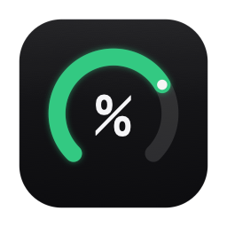
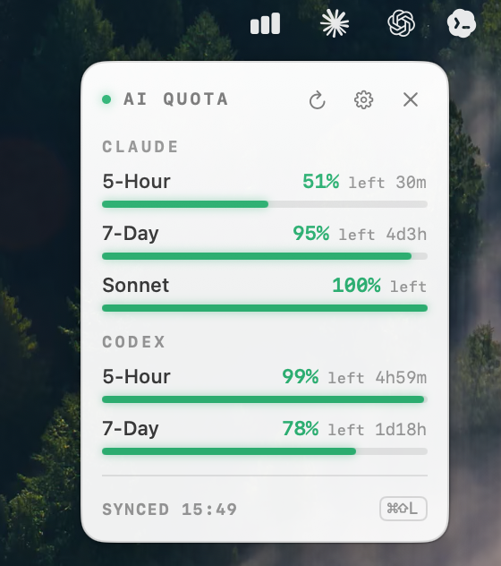

<div align="center">
  
  <h1>LimitHUD</h1>
  <p>A floating macOS HUD that keeps a live eye on your <b>Claude</b> and <b>Codex (ChatGPT)</b> usage quotas — and warns you before you run out.</p>
  <p>Stays out of your menu bar · floats above everything · fully customizable reminders & looks.</p>
  <p>
    
    
    
    
  </p>
  <br>
  
</div>

---

## Features

### Quota monitoring
- **Both providers, real numbers** — Claude and Codex (ChatGPT), straight from each service's own usage API (not estimates).
- **Claude**: `5-Hour` and `7-Day` windows, plus per-model weekly limits (`Opus`, `Sonnet`, hidden by default).
- **Codex**: `5-Hour` (primary) and `7-Day` (secondary/weekly) windows.
- Everything is shown as **remaining** (`% left`), not used.
- **Auto-refresh** every 30s / 1min / 5min, with a **reset countdown** per window (e.g. `2h13m`, `3d20h`).
- Graceful error rows per provider (not signed in / session expired / HTTP error) — never crashes, never blocks the other provider.

### The floating card
- Floats on screen, **always on top** across every Space and over other apps' full-screen — until you close it.
- **Draggable** anywhere.
- Quiet dark design — solid frosted surface, hairline border, monospaced uppercase system labels.
- **Semantic progress bars**: green > 50%, amber 20–50%, red < 20%.
- `SYNCED HH:mm` timestamp, refreshed each minute.
- **Follows the system light/dark appearance** automatically.
- **Resizable** (size slider) and a **custom background color** — text stays readable on any color.
- **Remembers where you drag it.**
- Close via the card's ✕, the menu-bar icon, or the global hotkey.

### Menu bar
- A **single icon** (8 styles to pick from, switchable live), so it barely takes a slot.
- **Left-click** toggles the card (pops up right under the icon).
- **Right-click** menu: Settings… / Refresh / Quit.

### Reminders
- **Low-quota alert** — a system notification when any window drops below your threshold (default 20%).
- **Recovery reminder** — a notification when a window resets back above the threshold.
- Edge-detected, so it fires once per crossing (no spam).
- System notification + sound toggles, plus **quiet hours** to mute reminders during a daily window.

### Settings (⚙ / right-click → Settings… / ⌘,)
- **Reminders** — alert on/off, threshold %, recovery reminder, notifications, sound, quiet hours.
- **Sources** — Claude / Codex toggles.
- **Browser** — read Claude and Codex from **different browsers / profiles** (great when they're under different Google accounts).
- **Card content** — per-window toggles to choose exactly what shows.
- **Refresh** — 30s / 1min / 5min.
- **Card** — custom global hotkey, **size**, **custom background, text & bar color**, remember position, launch at login, opacity.

---

## Privacy & Security

LimitHUD reads your **browser's session cookies locally** to call each service's own usage endpoint:

- Cookies are decrypted **on-device** (the browser's SQLite store + the encryption key from your login Keychain) and used **only** as the `Cookie` header to `claude.ai` / `chatgpt.com`.
- **Nothing is sent anywhere else.** No servers, no analytics, no telemetry.
- The whole thing is open source — audit it.
- On first run macOS asks once for **Keychain access** (to read the browser's key) and once for **notifications**. Click Allow.

---

## Requirements

- macOS 13+
- Signed into `claude.ai` and/or `chatgpt.com` in a supported browser — **Chrome, Brave, Edge, Arc, Vivaldi, Chromium, or Opera**
- A Swift toolchain to build (Xcode **or** Command Line Tools — full Xcode not required)

## Download & run (no build)

1. Download **LimitHUD.zip** from the [latest release](https://github.com/zetagao/LimitHUD/releases/latest).
2. Unzip and drag **LimitHUD.app** into your **Applications** folder.
3. **First launch** — the app is signed by an independent developer (not via the App Store), so macOS blocks it once:
   - Double-click it. When macOS says it can't verify the developer, open **System Settings → Privacy & Security**, scroll to the bottom, and click **Open Anyway**, then confirm. *(On older macOS you can instead Control-click the app → **Open**.)*
4. Click **Allow** when macOS asks for **Keychain** access (to read the browser's cookie key) and for **Notifications**.
5. Make sure you're signed into `claude.ai` / `chatgpt.com` in a supported browser (Chrome, Brave, Edge, Arc, Vivaldi, Chromium, or Opera).

> The app is open source and code-signed, but not Apple-notarized — that one-time warning is expected. Prefer to audit and build it yourself? See below.

## Build & Install

```bash
./setup-signing.sh    # once: create a stable self-signed code-signing cert
./build.sh            # compile + sign  →  LimitHUD.app
./build.sh run        # build and launch
./build.sh install    # build, install to /Applications, launch
./build.sh release v1.1   # build + zip + publish to a GitHub release (omit tag to re-upload latest)
```

The self-signed cert keeps the app's code identity stable across rebuilds, so the Keychain "Always Allow" sticks.

To regenerate the app icon:

```bash
swift tools/icongen.swift AppIcon.iconset && iconutil -c icns AppIcon.iconset -o AppIcon.icns
```

## How it works

- **Swift + SwiftUI + AppKit**, built with Swift Package Manager — **no Xcode project needed** (`build.sh` assembles the `.app` by hand).
- The card is a borderless, non-activating `NSPanel` at `.statusBar` level hosting a SwiftUI view.
- Chrome cookie decryption: read the Cookies SQLite DB → fetch the `Chrome Safe Storage` key from the Keychain → PBKDF2-SHA1 (salt `saltysalt`, 1003 rounds) → AES-128-CBC (handling the 32-byte domain-hash prefix on Chrome ≥ v24). A small system module (`CBridge`) bridges `sqlite3` + `CommonCrypto`.

## License

MIT — see [LICENSE](LICENSE).

---

<details>
<summary><b>中文说明</b></summary>

## 简介

一个 macOS 悬浮小工具，实时盯着 **Claude** 与 **Codex (ChatGPT)** 的额度，快用完前提醒你。不占菜单栏、悬浮在屏幕、可自定义提醒与外观。

## 功能

**额度监控**
- 两家**官方真实额度**（非估算）：Claude（`5-Hour`/`7-Day`，外加分模型周额度 `Opus`/`Sonnet`，默认隐藏）、Codex（`5-Hour` 主 / `7-Day` 次）。
- 统一显示**剩余**（`% left`）；自动刷新（30s/1min/5min）；每窗口**重置倒计时**。
- 按家显示错误态（未登录/失效/报错），不崩、不连累另一家。

**悬浮卡片**
- 屏幕悬浮、**始终置顶**（跨桌面、盖全屏），可拖动、**记住位置**。
- 克制暗色设计、等宽大写标签、**三档语义色进度条**（绿/黄/红）。
- 左下角 `SYNCED HH:mm`；**跟随系统明暗自动切换**。
- **可缩放大小** + **自定义背景色**（文字色随背景明暗自动翻转，保证可读）。
- 三种关闭：卡片 ✕ / 菜单栏图标 / 全局快捷键。

**菜单栏**：单图标（8 种样式可换），左键显隐（贴图标下方弹出），右键菜单 Settings… / Refresh / Quit。

**提醒**：低额阈值告警（默认 <20%）、额度恢复提醒、边沿检测不刷屏、通知+声音开关、**勿扰时段**。

**设置**：REMINDERS（告警/阈值/恢复/通知/声音/勿扰时段）、SOURCES（Claude/Codex 开关）、BROWSER（Claude 与 Codex 可各自选不同浏览器/profile，适配两个不同 Google 账号）、CARD CONTENT（逐窗口自定义显示）、REFRESH（间隔）、CARD（自定义快捷键/缩放/背景色+文字色+进度条色/位置记忆/开机自启/透明度）。

## 隐私与安全

LimitHUD 在**本地**读取浏览器登录 cookie，仅用于调用各服务自己的额度接口：cookie 在本机解密（SQLite + 你的登录钥匙串），**只**作为 `Cookie` 头发给 `claude.ai` / `chatgpt.com`，**不外传任何地方**，无服务器、无统计。代码开源可审计。首次运行会各弹一次钥匙串授权与通知授权，点允许即可。

## 环境要求
- macOS 13+
- 用支持的浏览器登录了 `claude.ai` 和/或 `chatgpt.com` —— **Chrome / Brave / Edge / Arc / Vivaldi / Chromium / Opera**
- 有 Swift 工具链（Xcode 或 Command Line Tools，无需完整 Xcode）

## 下载即用（免编译）

1. 在 [最新 release](https://github.com/zetagao/LimitHUD/releases/latest) 下载 **LimitHUD.zip**。
2. 解压，把 **LimitHUD.app** 拖进**应用程序**文件夹。
3. **首次打开** —— app 由独立开发者签名（非 App Store），macOS 会拦一次：
   - 双击它。提示「无法验证开发者」后，打开**系统设置 → 隐私与安全性**，拉到底部点 **仍要打开**，确认。*（旧版 macOS 可改为右键 app → 打开。）*
4. macOS 弹**钥匙串**授权（读 Chrome 的 cookie 密钥）和**通知**授权时，点**允许**。
5. 确保已用 **Google Chrome** 登录 `claude.ai` / `chatgpt.com`。

> app 已开源、已签名，只是没做 Apple 公证，那一次性警告是正常的。想审计代码自己编译？见下。

## 构建 / 安装

```bash
./setup-signing.sh    # 首次：创建稳定自签名证书
./build.sh            # 编译 + 签名 → LimitHUD.app
./build.sh run        # 编译并启动
./build.sh install    # 编译 + 装到 /Applications 并启动
```

自签名证书让 app 身份跨重编译稳定，钥匙串「始终允许」一次后永久记住。

</details>
